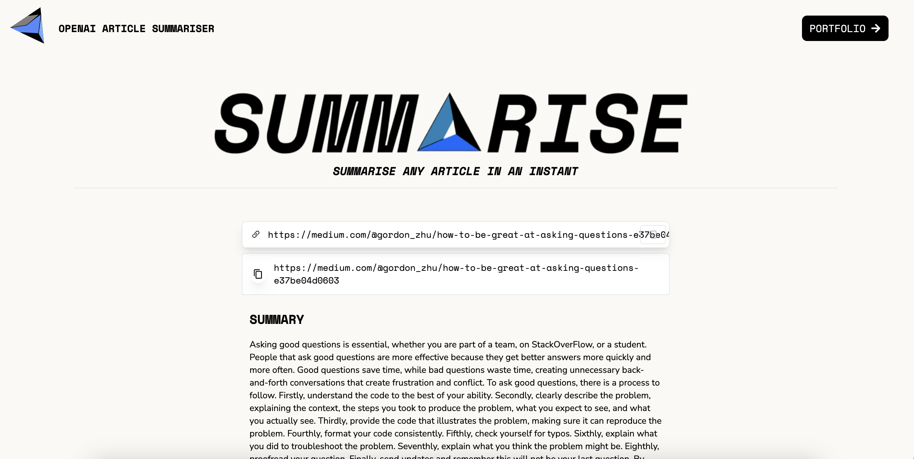

# SUMM△RISE: AI Article Summariser 

Link to deployed site: [https://ai-article-summariser.netlify.app](https://ai-article-summariser.netlify.app)

## Description 

This project is an example of how to use the Article Extractor and Summarizer API provided by RapidAPI to extract and summarize text from articles using GPT, a powerful language model developed by OpenAI. With this API, you can easily extract the main content of a webpage and generate a summary that captures the key points of the article. The project also showcases the use of Redux Toolkit for state management, TailwindCSS for styling, and React.js as the front-end framework.

The ability to automatically extract and summarize text is incredibly useful in many different contexts. For example, news organizations can use this API to automatically generate summaries for breaking news stories, saving journalists time and effort. Researchers can use it to quickly summarize academic papers and identify key findings. And individuals can use it to extract the main points of a long article, allowing them to quickly understand the key concepts without having to read through the entire piece.

The Article Extractor and Summarizer API uses GPT, a state-of-the-art language model developed by OpenAI. GPT is capable of generating high-quality summaries of text, making it an ideal choice for this API. Additionally, the API is provided by RapidAPI, which is a platform for building and consuming APIs. RapidAPI makes it easy to integrate APIs into your projects by providing a single, unified interface for working with a wide variety of APIs.

In this project, we use Redux Toolkit for state management. Redux Toolkit is a library for efficient Redux development that includes utilities for simplifying common Redux use cases. We also use TailwindCSS for styling, which is a utility-first CSS framework for quickly building custom user interfaces. Finally, we use React.js as the front-end framework, which is a JavaScript library for building user interfaces.

Overall, this project demonstrates the power of the Article Extractor and Summarizer API and how it can be easily integrated into a React.js project using Redux Toolkit. Whether you are a journalist, researcher, or just someone who wants to save time when reading articles, this API can help you quickly extract and summarize the main points of any text.

#### Technologies Used
This project was built using the following technologies:

- Redux Toolkit: A library for efficient Redux development that includes utilities for simplifying common Redux use cases.
- TailwindCSS: A utility-first CSS framework for quickly building custom user interfaces.
- React.js: A JavaScript library for building user interfaces.
- RapidAPI: A platform for building and consuming APIs.

## Installation 
N/A

## Usage

#### Users 
Please visit the [deployed site](https://ai-article-summariser.netlify.app) on Netlify. When the user has a URL of an article they want summarised, they need to paste it into the input field. After a couple of seconds, a summary will be displayed below. 


Screenshot of the application: 



#### Developers

To use this project, you will need to have a RapidAPI account and obtain an API key for the Article Extractor and Summarizer API. You can sign up for a RapidAPI account and subscribe to the API on the RapidAPI website.

Once you have your API key, you can clone this repository and install the necessary dependencies using npm:
```
npm install 
```

You will also need to create a .env file in the root directory of the project and add your RapidAPI API key as follows:
```
VITE_RAPID_API_KEY=<your-rapidapi-api-key>
```

To use the application, simply run the following command:
```
npm run dev
```

## Contributing 
If you would like to contribute, you are very welcome to! For this repo, the "fork-and-pull" Git workflow will be used.

Steps:

1. Fork the repo on GitHub
2. Clone the project to your own machine
3. Create a feature branch (git checkout -b BRANCH_NAME) and commit changes to your own branch
4. Push your work back up to your fork
5. Submit a Pull request so that we can review your changes
6. Be sure to merge the latest from "upstream" before making a pull request!

---
## Questions
If you have any questions, please contact me via email at: cameron.edek.poole@gmail.com
You are also welcome to follow and message me on [LinkedIn](https://www.linkedin.com/in/cam-edek-poole/) or contact me via [this form](https://cedekpoole.com/contact)

